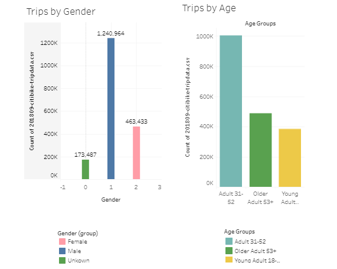
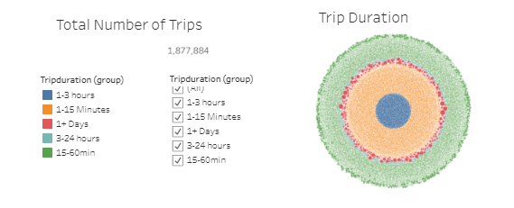
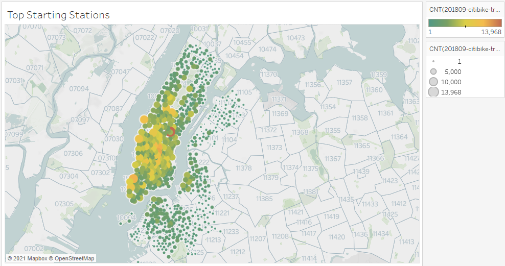

# Citi Bike Analysis - Tableau

Click the link to find the workbook.
https://public.tableau.com/app/profile/ryan.sabon/viz/CitiBike-TableauAssigment/Story1

## Objective
Create a dashboard and uncover trends and problem areas.

## Dashborad Analysis/Findings
The dashboard shows the different types of: 

#### Customers

#### Trip Information

#### Station Info

### Data
Data is collected and organized from the Citi
https://www.citibikenyc.com/system-data

